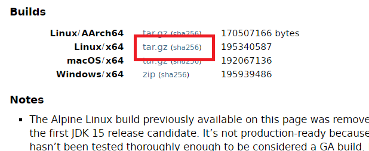

## 🔨 Flutter 삽질기#1

<br />

### 앱개발에 관심을 가진 것이 발단이었다.

나는 스마트폰이 정말 혁신 중 혁신이라고 생각하고 있었고 언젠가 앱개발도 꼭 해보려는 생각을 갖고 있었다.

그러던 중 최근 Flutter에 관심이 갔다.

Flutter가 Google갓께서 관리하는 모바일(을 넘어 웹까지 넘보고 있는) 크로스 플랫폼 프레임워크인 것은 이제 너무 유명하여 다들 잘 알것이다.

나는 Windows를 사용중이었고 모든 개발환경 세팅을 WSL2 우분투 위에서 하려고 했는데...

<br />

### OpenJDK 설치

Windows에선 그냥 인스톨러로 스윽 설치했던 JDK 설치도 Ubuntu에선 여간 까다로운 것이 아니더라.

[https://dev.to/adibemohamed/installing-openjdk-15-on-ubuntu-20-04-451i](https://dev.to/adibemohamed/installing-openjdk-15-on-ubuntu-20-04-451i)

👆 링크를 참조하였다.

<br />

#### JDK 다운로드

[https://jdk.java.net/](https://jdk.java.net/)

👆 링크에서



OpenJDK 파일을 받아서 WSL2에 넣어준다. 아무 폴더나 상관 없다.

<br />

#### 귀찮은 커맨드들...

아래의 커맨드 중 OpenJDK 버전은 작성일 기준 최신버전인 15.0.2 기준으로 작성되었으니, 추후 업데이트 시 파일명/디렉토리명을 바꿔서 사용하자.

<br />

```bash
sudo mkdir /usr/lib/java
```

먼저 `/usr/lib/` 아래에 java 폴더를 만든다.

<br />

OpenJDK 설치 파일을 넣어둔 곳으로 이동한 후

```bash
sudo tar -xvf openjdk-15.0.2_linux-x64_bin.tar.gz -C /usr/lib/java
```

압축 풀어주고...

`~/.bashrc`를 열어서 마지막에

<br />

```bash
export JAVA_HOME=/usr/lib/java/jdk-15.0.2
export PATH=$JAVA_HOME/bin:$PATH
```

를 넣어주고

<br />

```bash
source ~/.bashrc
```

해준다. 그럼 환경변수 설정이 완료된다.

❔ 난 zsh를 사용중이었는데, shopt: not found 라는 에러가 떴다.

`exec bash`, `source ~/.bashrc`, `exec zsh` 하면 잘 된다.

<br />

```bash
echo $JAVA_HOME
```

으로 확인해보자.

<br />

```bash
sudo update-alternatives --install "/usr/bin/java" "java" "/usr/lib/java/jdk-15.0.2/bin/java" 0
sudo update-alternatives --install "/usr/bin/javac" "javac" "/usr/lib/java/jdk-15.0.2/bin/javac" 0
sudo update-alternatives --install "/usr/bin/javap" "javap" "/usr/lib/java/jdk-15.0.2/bin/javap" 0
sudo update-alternatives --set java /usr/lib/java/jdk-15.0.2/bin/java
sudo update-alternatives --set javac /usr/lib/java/jdk-15.0.2/bin/javac
sudo update-alternatives --set javap /usr/lib/java/jdk-15.0.2/bin/javap
update-alternatives --list java
update-alternatives --list javac
update-alternatives --list javap
```

JDK의 위치를 설정해주기 위해 위의 커맨드를 입력한다.

나는 한 줄씩 입력했는데, 아마 전체를 카피앤페이스트 해도 잘될 듯?

그럼 일단 JDK 설치는 끝난 것이다.

<br />

Flutter 설정 삽질기는 #2에서 Android SDK 설치로 계속...
